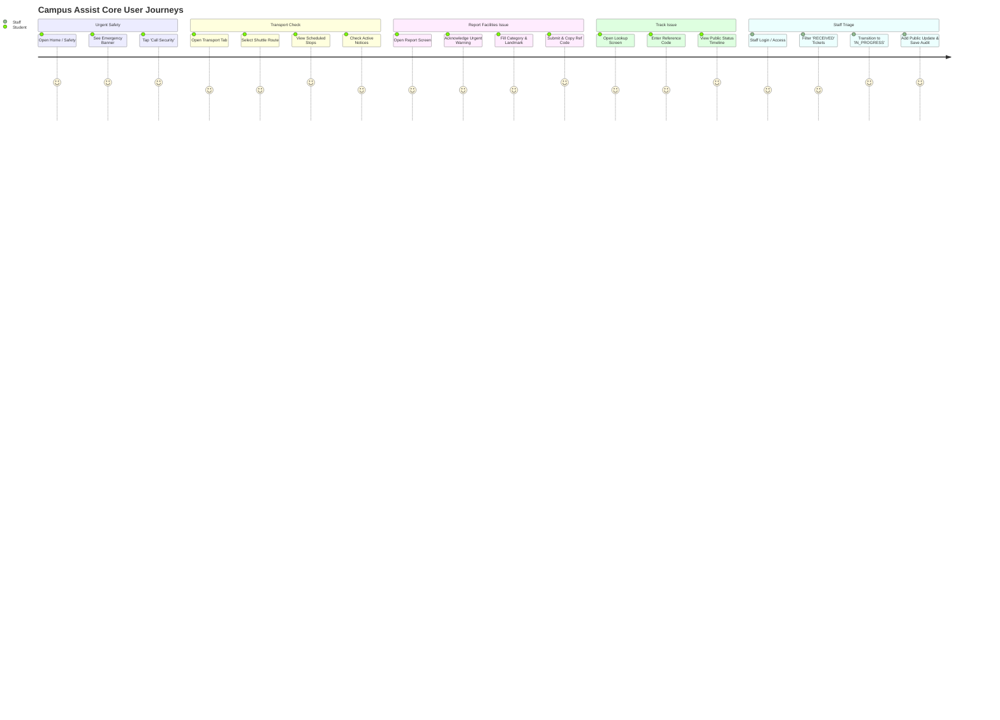

# Campus Assist — Product Requirements Document (PRD)

**Document Status:** Phase 0 Baseline  
**Document Version:** 1.0.0  
**Authors & Team Stakeholders:** Ishika, Tishya, Krisha, Vansh  
**Target Implementation Engine:** Antigravity AI Engineering Pair  
**Product Type:** Responsive Campus Web Application (Mobile-First)

---

## 1. Executive Summary & Vision

**Campus Assist** is a unified, student-centered campus web application designed to solve the chronic fragmentation of everyday campus operational information. On university campuses, critical information is routinely scattered across physical noticeboards, disorganized WhatsApp/Telegram group chats, unofficial social media threads, and obscure departmental web pages. 

Campus Assist brings together three mission-critical operational pillars into a single, cohesive, mobile-first interface:
1. **Safety & Emergency Directory:** Instant, zero-friction access to verified campus security contacts and physical safe zones.
2. **Campus Transport Timetables:** Structured, truthful schedules and route notices for campus shuttles, without misleading claims of live vehicle tracking.
3. **Facilities & Issue Reporting:** A trackable, privacy-preserving incident reporting pipeline for physical infrastructure problems (lighting, sanitation, accessibility, damage) with a transparent staff triage workflow.

### Core Philosophy
* **Truth in Capability:** The application presents verified, scheduled data. It never simulates real-time vehicle GPS tracking, does not act as an emergency dispatch/monitoring system, and clearly labels sample/demo data.
* **Zero-Friction Access:** Critical safety contacts and timetable information must be accessible without requiring user registration, login, or personal identification.
* **Privacy by Default:** Issue reporting collects only what is necessary to resolve physical defects, issuing non-sequential reference codes and public status projections that protect student anonymity.
* **Architectural Rigor:** Built following modular boundaries and strict **SOLID design principles**, ensuring testability, maintainability, and clean separation between student-facing views and administrative triage.

---

## 2. Problem Statement & User Personas

### 2.1 The Problem
Students and visitors encounter frequent daily friction:
* **Emergency Panic & Hesitation:** In an urgent situation or after dark, students struggle to locate the canonical campus security hotline or assembly locations.
* **Transit Uncertainty:** Campus shuttle timings are unpredictable, leading to missed connections or crowding; students lack an authoritative source for operating days, stoppage sequences, and active service disruption notices.
* **Reporting Void:** When infrastructure fails (e.g., a dark walkway light, broken accessibility elevator, plumbing overflow), students report it informally in group chats where it gets lost, or do not report it at all because there is no clear tracking mechanism or feedback loop.

### 2.2 Target User Personas

| Persona | Role | Key Goals & Needs | Pain Points & Constraints |
|---|---|---|---|
| **Student / Visitor** | Primary consumer & reporter | Quickly find emergency telephone numbers; check shuttle timings for a specific stop; report a broken light with a landmark description; track ticket progress. | Using low-end mobile devices on spotty campus Wi-Fi; does not want to install another native app or create an account just to check a bus time or report a leaky faucet. |
| **Campus Staff Reviewer** | Operations & facilities triage | Review incoming facility tickets; filter by category and location; update ticket status (`RECEIVED` &rarr; `IN_REVIEW` &rarr; `IN_PROGRESS` &rarr; `RESOLVED`); publish clear student-facing status notes. | Overwhelmed by duplicate tickets; needs a protected, clutter-free triage queue with an auditable change history; must keep internal notes private. |
| **Content Maintainer** | Administrative data curator | Keep emergency contacts, safety zones, transit routes, schedules, and service disruption alerts up to date with clear verification timestamps. | Needs deterministic schemas and explicit verification dates to ensure expired transit notices or obsolete phone numbers are never shown as current. |

---

## 3. Product Goals & Measurable Success Criteria

### 3.1 Primary Goals
1. **One-Tap Emergency Access:** Allow any student or visitor to trigger a verified campus security telephone call (`tel:`) or view emergency safe locations from the homepage in exactly **one user action** without authentication.
2. **Frictionless Transport Ingestion:** Enable lookup of any shuttle route, stop sequence, operating schedule, and service alert in under **10 seconds** without requiring an account.
3. **Traceable Facility Reporting:** Enable submission of a campus issue in under **60 seconds**, generating a secure, non-sequential reference code (e.g., `CA-7842-X9`).
4. **Transparent Status Tracking:** Provide a dedicated lookup interface where reporters can query their reference code to see safe, sanitized public progress updates without exposing personal data.
5. **Auditable Staff Operations:** Deliver an authenticated staff triage view enforcing valid state machine transitions with an immutable audit log (actor, timestamp, status change, public note).

### 3.2 Non-Goals & Explicit Anti-Requirements (MVP Scope Boundaries)
To ensure delivery excellence and prevent dangerous misrepresentations, the following are strictly **OUT OF SCOPE**:
* **Emergency Dispatch / 911 / Police Replacement:** The app is *not* a panic button or CAD (Computer-Aided Dispatch) system. It does not monitor incoming tickets in real-time.
* **Live GPS / Telemetry Transit Tracking:** No fake bus animations, synthetic arrival countdowns, or simulated live coordinates. Schedules are strictly labeled *“Scheduled Times — Not Live Vehicle Tracking”*.
* **Public Social Feed & Commenting:** No upvoting, public discussion boards, peer-to-peer messaging, or open galleries of reported photos.
* **Public Directory of Submissions:** Reports are strictly private; tickets can only be looked up individually via a matching reference code (and secret token).
* **Payment Gateways, Native App Wrappers, or Third-Party Map SDKs:** Avoid heavy external paid APIs (e.g., Google Maps API keys) for the baseline. Accessible textual landmark directions and semantic HTML replace heavy map widgets.

---

## 4. Comprehensive Feature Scope & Requirements

### 4.1 Pillar 1: Safety & Emergency Information
* **Prominent Emergency Call Action:** A persistent, high-contrast callout banner on both the Home and Safety pages featuring a native `tel:` protocol hyperlink and a clearly legible phone number that can be copied to the clipboard.
* **Emergency Demarcation Disclaimer:** Explicit copy stating: *“Campus Assist is an informational directory, not an emergency response or monitoring service. If you are in immediate danger, dial Campus Security directly or contact official emergency services.”*
* **Verified Directory:** Structured list of verified campus emergency resources:
  - 24/7 Campus Security Control Room.
  - Campus Health & First Aid Clinic.
  - Women’s Safety & Student Counseling Helpline.
  - Designated Campus Night Assembly & Safe Zones.
* **Verification & Freshness Metadata:** Every entry must display its authoritative source and last verified timestamp (e.g., *“Verified: Oct 2026 by Campus Safety Office”*). Seed/sample data must be visibly tagged with a `DEMO DATA` badge.

### 4.2 Pillar 2: Campus Transport Schedules
* **Route Catalog & Filter:** Browse active shuttle routes (e.g., *North Campus Loop*, *Hostel to Metro Shuttle*, *Library Express*). Filter by operating day (Weekday, Weekend, Exam Schedule).
* **Stop Sequence & Timetables:** Display ordered stops with scheduled departure timings expressed in the authoritative campus time zone.
* **Service Disruption Notices:** Prominent alert banners for route diversions, bad-weather suspensions, or holiday schedules. Each notice must specify valid `startsAt` and `endsAt` dates; expired notices automatically de-activate.
* **Honest Unavailable States:** If a schedule is seasonal, suspended, or unverified, display an informative unavailable notice with a fallback link to the university’s official transportation office instead of blank screens or mock data.

### 4.3 Pillar 3: Facilities & Campus Issue Reporting
* **Zero-Login Submission:** Open reporting form requiring:
  - **Category (Enum):** `LIGHTING_ELECTRICAL`, `BUILDING_FACILITY`, `CLEANLINESS`, `ACCESSIBILITY`, `TRANSPORT_STOP`, `OTHER`.
  - **Landmark Location (Text):** Human-readable campus location (e.g., *“3rd Floor Engineering Block, Hallway near Room 304”*). No forced GPS coordinates.
  - **Description (Text):** Concise summary (15 to 500 characters) detailing the defect.
  - **Attachment (Optional):** Strict image upload (JPEG/PNG/WebP, max 3MB) with security sanitization, or gracefully disabled if private object storage is unavailable.
* **Emergency Intercept Warning:** A permanent modal or header warning above the form reminding users: *“Do not report fires, medical emergencies, or active threats here. Tap here to call Campus Security immediately.”*
* **Reference Generation:** On submission, the server returns an opaque, non-sequential reference code (e.g., `CA-4819-B3`) and an optional lookup secret.
* **Safe Public Lookup:** Anyone with the reference code can inspect ticket progress. The server returns a strictly sanitized projection:
  - Category, general location, status badge, submission date, and official public updates.
  - Reporter identity, internal staff commentary, and raw image filenames are strictly stripped.
* **Staff Triage & Lifecycle Management:**
  - Authenticated staff dashboard displaying incoming tickets sorted by submission recency.
  - State machine transition controls enforcing legal state moves:
    $$\text{RECEIVED} \longrightarrow \{\text{IN\_REVIEW}, \text{DUPLICATE}, \text{REJECTED}\}$$
    $$\text{IN\_REVIEW} \longrightarrow \{\text{IN\_PROGRESS}, \text{DUPLICATE}, \text{REJECTED}\}$$
    $$\text{IN\_PROGRESS} \longrightarrow \{\text{RESOLVED}, \text{IN\_REVIEW}\}$$
    $$\text{RESOLVED} \longrightarrow \{\text{IN\_REVIEW (Reopen)}\}$$
  - Transition form requiring an optional or mandatory public message explaining the status change to students.
  - Immutable audit trail recording actor identity, prior status, new status, timestamp, and optional private operational notes.

---

## 5. Core User Journeys

### Detailed User Flow Scenarios:
1. **Journey 1: Student Late Night Safe Travel / Emergency**
   * Student is walking across campus at 11:30 PM and notices an unlit perimeter pathway.
   * Student opens Campus Assist on mobile; the top banner immediately offers **Call Campus Security**.
   * Student taps the button; phone dialer launches with the verified security number pre-filled.
   * Student can immediately read the verified 24/7 Security Booth location directly underneath.
2. **Journey 2: Student Checking Shuttle Schedule**
   * Student needs to catch the shuttle from Hostel 4 to the Academic Complex.
   * Student taps **Transport**, selects *“Hostel Loop Shuttle”*.
   * App displays the stop sequence, showing next scheduled departure at 12:15 PM (clearly badged as *Scheduled Timetable, Asia/Kolkata*).
   * A service notice indicates: *“Hostel 3 stop temporarily relocated to Main Gate due to road resurfacing.”*
3. **Journey 3: Reporting a Water Leak in Science Library**
   * Student spots an overflowing water cooler in the Science Library basement.
   * Student taps **Report an Issue**, selects category `CLEANLINESS` or `BUILDING_FACILITY`.
   * Enters location: *“Science Library, Basement Corridor adjacent to Restroom A”*.
   * Enters brief description and submits.
   * App confirms receipt, displays reference code `CA-9182-K4` with a 1-tap **Copy Code** button.
4. **Journey 4: Staff Triage and Public Transparency**
   * Facilities staff member Vansh / Krisha logs into the protected triage interface.
   * Opens ticket `CA-9182-K4`. Status is `RECEIVED`.
   * Staff changes status to `IN_PROGRESS` and writes public update: *“Maintenance team dispatched with replacement valve.”*
   * Later that afternoon, the reporting student enters `CA-9182-K4` into the status tracker and sees the updated badge and maintenance note.

---

## 6. Privacy, Ethics & Data Governance

1. **Minimization of Personal Data (PII):**
   * Anonymous reporting is supported by default. Students are not coerced into submitting their Roll Number, Student ID, Email, phone number, or home address.
   * Location inputs are restricted to descriptive textual campus landmarks; no background geolocation or GPS coordinates are harvested.
2. **Public Data Sanitization:**
   * Public lookup APIs must return a dedicated projection DTO (`PublicReportView`).
   * Internal database primary keys (e.g., auto-incrementing integer IDs or internal UUIDs), reporter IP addresses, internal staff notes, and raw file names are strictly excluded from all public responses.
3. **Auditability & Accountability:**
   * Every administrative mutation must log the authenticated staff actor ID, IP address, timestamp, old state, and new state.
   * Public updates cannot be modified post-submission without creating an auditable revision entry.
4. **Demo Data Integrity:**
   * All sample records seeded for demonstrations must be explicitly flagged with `isDemo: true`.
   * UI components must display visual disclaimers on demo records to prevent users from mistaking mock emergency numbers for actual responders.

---

## 7. Success Criteria & Phase 0 Sign-Off

This PRD serves as the binding functional agreement between team members **Ishika, Tishya, Krisha, and Vansh** and implementation agent **Antigravity**.

* [x] Three functional pillars agreed and bounded.
* [x] Anti-goals (no live GPS, no dispatch claims) explicitly ratified.
* [x] Category and status enums finalized.
* [x] Privacy and non-sequential reference code requirements set.
* [x] Companion technical and architectural documents linked:
  - System Requirements Document: [`02-SRD-system-requirements.md`](file:///c:/Users/ishuv/ProjectWork/docs/02-SRD-system-requirements.md)
  - Architecture & SOLID Design: [`03-ARCHITECTURE-AND-SOLID-DESIGN.md`](file:///c:/Users/ishuv/ProjectWork/docs/03-ARCHITECTURE-AND-SOLID-DESIGN.md)
  - UX & Interface Specification: [`04-UX-UI-DESIGN-SPEC.md`](file:///c:/Users/ishuv/ProjectWork/docs/04-UX-UI-DESIGN-SPEC.md)
  - Phase Plan & Engineering Guide: [`05-PHASE-PLAN-AND-ENGINEERING-GUIDE.md`](file:///c:/Users/ishuv/ProjectWork/docs/05-PHASE-PLAN-AND-ENGINEERING-GUIDE.md)
