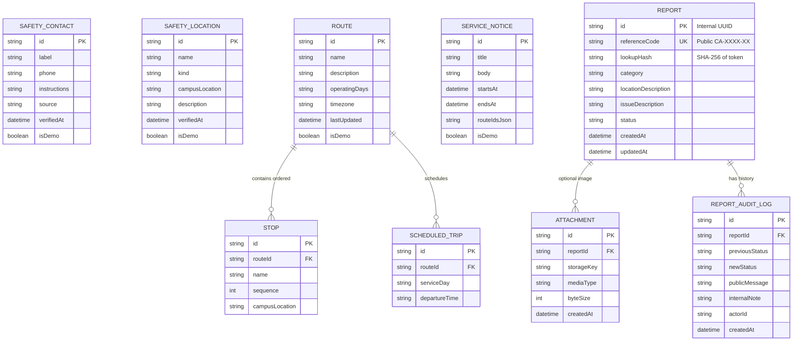
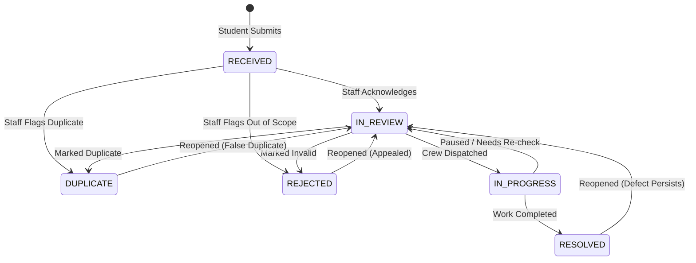

# Campus Assist — System & Software Requirements Document (SRD / SRS)

**Document Status:** Phase 0 Baseline  
**Document Version:** 1.0.0  
**Companion Documents:** 
- PRD: [`01-PRD-product-requirements.md`](file:///c:/Users/ishuv/ProjectWork/docs/01-PRD-product-requirements.md)
- Architecture & SOLID Design: [`03-ARCHITECTURE-AND-SOLID-DESIGN.md`](file:///c:/Users/ishuv/ProjectWork/docs/03-ARCHITECTURE-AND-SOLID-DESIGN.md)
- UX & Interface Specification: [`04-UX-UI-DESIGN-SPEC.md`](file:///c:/Users/ishuv/ProjectWork/docs/04-UX-UI-DESIGN-SPEC.md)
- Phase Plan & Engineering Guide: [`05-PHASE-PLAN-AND-ENGINEERING-GUIDE.md`](file:///c:/Users/ishuv/ProjectWork/docs/05-PHASE-PLAN-AND-ENGINEERING-GUIDE.md)

---

## 1. Purpose, Scope & Conventions

This specification details the technical requirements, interface contracts, data models, and non-functional constraints governing the **Campus Assist** system.

### RFC 2119 Key Words
* **MUST / SHALL / REQUIRED:** Absolute technical prerequisite for the MVP release gate.
* **SHOULD / RECOMMENDED:** Strongly advised best practice; deviations must have recorded justification.
* **MAY / OPTIONAL:** Permissible feature extension subject to milestone availability.

---

## 2. Functional Requirements Catalog

### 2.1 Pillar 1: Safety & Emergency Systems

| Requirement ID | Priority | Description & Acceptance Criteria |
|---|---|---|
| **SAF-01** | **MUST** | The Home page and Safety page MUST present the authoritative campus security emergency contact directly on load without requiring user authentication, cookies, or form entry. |
| **SAF-02** | **MUST** | The emergency action MUST invoke a native `tel:` link on compatible devices. The phone number MUST also be rendered as human-readable, copyable text with a dedicated 1-click clipboard copy button. |
| **SAF-03** | **MUST** | The UI MUST display a permanent safety notice stating: *“Campus Assist is not an emergency dispatch or live monitoring service. For immediate threats to life or safety, dial Campus Security or emergency services directly.”* |
| **SAF-04** | **MUST** | Every emergency contact and physical safety zone MUST include metadata fields: `source` (issuing department) and `verifiedAt` (timestamp). Seed or mock entries MUST have `isDemo: true` and display a prominent demo badge. |
| **SAF-05** | **SHOULD** | Physical safety resources (first aid rooms, night assembly booths, AED stations) SHOULD include descriptive walking directions and operating hours. They MUST NOT claim an unverified route is guaranteed safe. |
| **SAF-06** | **MUST** | The safety data endpoint MUST support cached or static offline fallback so that emergency contacts remain accessible if the reporting database is undergoing maintenance. |

### 2.2 Pillar 2: Campus Transport Schedules

| Requirement ID | Priority | Description & Acceptance Criteria |
|---|---|---|
| **TRN-01** | **MUST** | Users MUST be able to list all active shuttle routes and query detailed stoppage sequences and operating timetables without logging in. |
| **TRN-02** | **MUST** | Route detail views MUST display the canonical route name, ordered stop list, active days of the week, timetable departure hours, configured campus time zone, and `lastUpdated` date. |
| **TRN-03** | **MUST** | All transport schedule interfaces MUST be explicitly labeled: *“Scheduled Times — Not Live Vehicle Tracking”*. The UI MUST NOT render synthetic GPS dots, animated moving buses, or fabricated live countdown timers. |
| **TRN-04** | **MUST** | Active service disruption notices MUST specify `startsAt` and `endsAt` ISO-8601 timestamps and list affected `routeIds`. Expired notices MUST NOT be returned in active public views. |
| **TRN-05** | **MUST** | When no schedule data is available for a route or day, the system MUST return a structured `UNAVAILABLE` state with a link to the campus transportation office, rather than failing silently or rendering a broken layout. |
| **TRN-06** | **SHOULD** | The user interface SHOULD support client-side filtering by operating day (e.g., Weekday vs. Weekend vs. Exam Schedule) and stop name. |
| **TRN-07** | **MUST** | The backend schedule provider MUST be encapsulated behind a clean interface (`ITransportScheduleProvider`) to allow seamless future integration with institutional GTFS or transit feeds without breaking consumer contracts. |

### 2.3 Pillar 3: Facilities Problem Reporting & Triage

| Requirement ID | Priority | Description & Acceptance Criteria |
|---|---|---|
| **RPT-01** | **MUST** | The report submission form MUST enforce four required inputs: valid `category` (enum), `locationDescription` (string, 5–120 chars), `issueDescription` (string, 15–500 chars), and agreement to the privacy disclaimer. |
| **RPT-02** | **MUST** | An emergency warning panel MUST precede the form, instructing reporters that physical fires, medical hazards, and personal threats must be routed immediately to campus security hotline `SAF-01`. |
| **RPT-03** | **MUST** | Server-side validation MUST strictly validate input lengths, allowed categories, and request size, independent of client-side JavaScript validation. |
| **RPT-04** | **MUST** | Upon successful submission, the system MUST persist the report in state `RECEIVED` and generate an opaque, non-sequential public reference code (format: `CA-[4 digits]-[2 alphanumeric chars]`, e.g., `CA-4912-K7`). Internal auto-increment primary keys MUST NEVER be exposed. |
| **RPT-05** | **MUST** | The system SHOULD generate a cryptographic lookup secret token returned only to the reporter on creation. If enabled, public status lookup requires `referenceCode` + `lookupSecret`. If disabled, public lookup by `referenceCode` MUST only expose a stripped, non-sensitive projection. |
| **RPT-06** | **MUST** | Public lookup endpoint (`GET /api/reports/lookup/:reference`) MUST return strictly sanitized fields: `referenceCode`, `category`, `broadLocation`, `status`, `createdAt`, and approved `publicUpdates`. It MUST NEVER leak reporter contact info, internal staff notes, or raw server file paths. |
| **RPT-07** | **MUST** | The staff triage endpoints (`/api/staff/*`) MUST enforce role-based access control (RBAC). Requests without valid staff authentication credentials MUST receive HTTP 401 Unauthorized or HTTP 403 Forbidden. |
| **RPT-08** | **MUST** | Status changes MUST conform strictly to the state transition matrix (Section 4). Invalid transitions MUST be rejected with HTTP 422 Unprocessable Entity. |
| **RPT-09** | **MUST** | Every administrative state transition MUST atomically write an immutable audit log entry capturing `actorId`, `previousStatus`, `newStatus`, `publicNote`, `internalNote`, and `timestamp`. |
| **RPT-10** | **SHOULD** | Optional image attachment handling: If enabled, files MUST be checked for magic number signatures (JPEG, PNG, WebP only), capped at 3MB, stripped of EXIF metadata, and assigned a random UUID filename stored outside the web root. If secure storage is unavailable in the environment, the upload feature MUST be gracefully disabled in the UI. |
| **RPT-11** | **MUST** | There MUST NOT be any publicly accessible index or search directory of all submitted student reports. Submissions can only be queried individually using an exact reference code. |
| **RPT-12** | **SHOULD** | Staff MUST be able to classify an issue as `DUPLICATE` (referencing an existing ticket) or `REJECTED` (with an appropriate, courteous public explanation). |
| **RPT-13** | **MUST** | Idempotency handling: The report creation endpoint SHOULD accept an `Idempotency-Key` HTTP header to prevent duplicate ticket generation from accidental double-taps on mobile devices. |
| **RPT-14** | **MUST** | Reopening resolved tickets: A ticket in `RESOLVED`, `DUPLICATE`, or `REJECTED` state MAY be transitioned back to `IN_REVIEW` by authorized staff if the issue recurs. |

### 2.4 Cross-Cutting & Common Requirements

| Requirement ID | Priority | Description & Acceptance Criteria |
|---|---|---|
| **COM-01** | **MUST** | The global navigation bar MUST provide persistent links to Home, Safety, Transport, and Report an Issue across all viewports. |
| **COM-02** | **MUST** | Every data-fetching interface MUST implement distinct visual states: Loading skeleton/spinner, Success content, Empty data state, and Graceful error alert with retry button. |
| **COM-03** | **MUST** | All user mutations (report submission, status update) MUST display unambiguous confirmation feedback. Status change operations must feature an explicit confirmation dialog. |
| **COM-04** | **MUST** | All dates and times rendered across the client MUST use the configured campus time zone (e.g., `Asia/Kolkata` - IST, UTC+05:30) and display explicit AM/PM or 24-hr indicators. |
| **COM-05** | **MUST** | Seed data files MUST be cleanly separated from application code and clearly flagged. The system MUST provide an idempotent seeding script for demo environments. |
| **COM-06** | **MUST** | All application modules MUST adhere strictly to SOLID software engineering principles as detailed in [`03-ARCHITECTURE-AND-SOLID-DESIGN.md`](file:///c:/Users/ishuv/ProjectWork/docs/03-ARCHITECTURE-AND-SOLID-DESIGN.md). |

---

## 3. Data Entities & Relational Schema



### Detailed Field Specifications

#### `Report`
* `id`: `UUID` (Primary key, strictly internal).
* `referenceCode`: `VARCHAR(16)` (Unique, Indexed, e.g., `CA-7814-J9`).
* `lookupHash`: `VARCHAR(64)` (Nullable; SHA-256 hash of secret token).
* `category`: `VARCHAR(32)` (Enum: `LIGHTING_ELECTRICAL`, `BUILDING_FACILITY`, `CLEANLINESS`, `ACCESSIBILITY`, `TRANSPORT_STOP`, `OTHER`).
* `locationDescription`: `VARCHAR(255)` (Landmark-based campus location).
* `issueDescription`: `TEXT` (15 to 500 characters).
* `status`: `VARCHAR(24)` (Default: `RECEIVED`).
* `createdAt`: `DATETIME` (ISO-8601 UTC).
* `updatedAt`: `DATETIME` (ISO-8601 UTC).

#### `ReportAuditLog`
* `id`: `UUID` (Primary key).
* `reportId`: `UUID` (Foreign key to `Report.id`).
* `previousStatus`: `VARCHAR(24)`.
* `newStatus`: `VARCHAR(24)`.
* `publicMessage`: `TEXT` (Sanitized text visible on public lookup).
* `internalNote`: `TEXT` (Confidential staff note, strictly hidden from public API).
* `actorId`: `VARCHAR(64)` (Staff username or identifier).
* `createdAt`: `DATETIME` (ISO-8601 UTC).

---

## 4. State Machine & Status Transition Matrix

### 4.1 State Definitions
* **`RECEIVED`**: Ticket submitted by student; awaiting staff review.
* **`IN_REVIEW`**: Staff member has inspected the report and acknowledged responsibility.
* **`IN_PROGRESS`**: Facilities or maintenance crew has been dispatched / work is underway.
* **`RESOLVED`**: Work completed or defect corrected.
* **`DUPLICATE`**: Identical defect already logged under another reference code.
* **`REJECTED`**: Out of operational scope, unactionable, or invalid request.

### 4.2 Transition Rules Matrix



| Source State | Target State | Authorized Actor | Guard Conditions / Actions |
|---|---|---|---|
| `RECEIVED` | `IN_REVIEW` | Staff | Generates audit log; optional public acknowledgement. |
| `RECEIVED` | `DUPLICATE` | Staff | Requires reference code of original ticket in `publicMessage`. |
| `RECEIVED` | `REJECTED` | Staff | Requires non-sensitive explanation in `publicMessage`. |
| `IN_REVIEW` | `IN_PROGRESS` | Staff | Optional ETA or action summary in `publicMessage`. |
| `IN_REVIEW` | `DUPLICATE` | Staff | Requires duplicate reference code note. |
| `IN_REVIEW` | `REJECTED` | Staff | Requires rejection reason. |
| `IN_PROGRESS` | `RESOLVED` | Staff | Mandatory resolution note in `publicMessage`. |
| `IN_PROGRESS` | `IN_REVIEW` | Staff | Used if work is halted or requires departmental reassignment. |
| `RESOLVED` | `IN_REVIEW` | Staff | Reopen action; required explanation. |
| `DUPLICATE` | `IN_REVIEW` | Staff | Reopen action if duplicate flag was erroneous. |
| `REJECTED` | `IN_REVIEW` | Staff | Reopen action if rejection was contested. |

---

## 5. Interface Contracts & API Specifications

All endpoints return JSON. Mutations return structured errors conforming to standard problem details.

### 5.1 Public Endpoints

#### `GET /api/safety`
* **Access:** Public (Unauthenticated)
* **Response `200 OK`:**
```json
{
  "emergencyHelpline": {
    "label": "Campus Security 24/7 Control Room",
    "phone": "+91-11-2659-1000",
    "instructions": "Call for immediate on-campus security assistance, fire, or medical rescue.",
    "source": "Office of Campus Safety & Security",
    "verifiedAt": "2026-10-01T08:00:00Z",
    "isDemo": true
  },
  "contacts": [
    {
      "id": "sec-health",
      "label": "Campus Health Centre",
      "phone": "+91-11-2659-1111",
      "instructions": "Outpatient clinic and ambulance dispatch.",
      "source": "Chief Medical Officer",
      "verifiedAt": "2026-10-01T08:00:00Z",
      "isDemo": true
    }
  ],
  "locations": [
    {
      "id": "loc-safe-01",
      "name": "Main Gate 24/7 Security Booth",
      "kind": "SECURITY_POST",
      "campusLocation": "Gate No. 1, North Avenue",
      "description": "Staffed 24 hours. First-aid kit and AED available.",
      "verifiedAt": "2026-10-01T08:00:00Z",
      "isDemo": true
    }
  ]
}
```

#### `GET /api/routes`
* **Access:** Public
* **Response `200 OK`:** Array of routes with stops, schedules, active notices, and `isDemo` flags.

#### `POST /api/reports`
* **Access:** Public
* **Headers:** `Content-Type: application/json`, `Idempotency-Key: <UUID>` (Optional)
* **Request Body:**
```json
{
  "category": "LIGHTING_ELECTRICAL",
  "locationDescription": "Walkway between Academic Block 2 and Library",
  "issueDescription": "Overhead streetlamp #14 is flickering and completely dark at night.",
  "privacyAgreed": true
}
```
* **Response `201 Created`:**
```json
{
  "referenceCode": "CA-4819-B3",
  "status": "RECEIVED",
  "createdAt": "2026-10-07T07:15:00Z",
  "message": "Report received successfully. Save your reference code to check progress."
}
```

#### `GET /api/reports/lookup/:referenceCode`
* **Access:** Public (Requires exact reference code)
* **Response `200 OK`:**
```json
{
  "referenceCode": "CA-4819-B3",
  "category": "LIGHTING_ELECTRICAL",
  "locationDescription": "Walkway between Academic Block 2 and Library",
  "status": "IN_PROGRESS",
  "createdAt": "2026-10-07T07:15:00Z",
  "updates": [
    {
      "status": "IN_PROGRESS",
      "message": "Electrician team dispatched with replacement fixture.",
      "timestamp": "2026-10-07T08:30:00Z"
    }
  ]
}
```

### 5.2 Protected Staff Endpoints

#### `GET /api/staff/reports`
* **Access:** Staff Role Only (`Authorization: Bearer <TOKEN>` or Session Cookie)
* **Query Params:** `status`, `category`, `limit`, `offset`
* **Response `200 OK`:** Paginated full report records including internal IDs, descriptions, and audit history.

#### `PATCH /api/staff/reports/:id/status`
* **Access:** Staff Role Only
* **Request Body:**
```json
{
  "targetStatus": "IN_PROGRESS",
  "publicMessage": "Electrician team dispatched with replacement fixture.",
  "internalNote": "Assigned to work order #E-401 (Contractor: Verma Electricals)."
}
```
* **Response `200 OK`:** Updated report object and generated audit log entry.

### 5.3 Standard Error Format (RFC 7807 Compliant)
```json
{
  "error": {
    "code": "VALIDATION_FAILED",
    "message": "The submission contains invalid or missing required fields.",
    "status": 422,
    "fields": {
      "issueDescription": "Description must be between 15 and 500 characters."
    }
  }
}
```

---

## 6. Non-Functional Requirements (NFR)

* **NFR-01 Availability & Resilience:** Emergency contact phone numbers and safe locations must be statically bakeable or aggressively cached so that a backend database outage does not block emergency dialer access.
* **NFR-02 Performance:** Time-to-Interactive (TTI) on a standard 4G mobile connection must be under 1.8 seconds. Initial bundle size must remain lean (<150KB uncompressed JS/CSS).
* **NFR-03 Accessibility (WCAG 2.2 AA):** All screens must be 100% operable via keyboard. Color contrast must meet or exceed 4.5:1 for standard text. Form controls must have associated label elements and aria-describedby error announcements.
* **NFR-04 Privacy by Design:** The system will not request or persist student personal identities. Public lookup endpoints will only return safe public projection DTOs.
* **NFR-05 Security:** 
  - Strict input sanitization (defense against XSS and injection).
  - Rate limiting on `POST /api/reports` (e.g., max 5 requests per minute per IP) and `/api/reports/lookup` (max 20 per minute per IP) to prevent enumeration.
  - Staff routes protected with cryptographically secure session or JWT validation.
* **NFR-06 File Upload Hardening:** If attachments are enabled, files must be validated via MIME sniffing (magic bytes), capped at 3MB, sanitized of EXIF metadata, stored in isolated non-executable object storage, and retrieved only via presigned or authenticated URLs.
* **NFR-07 SOLID Architecture:** The codebase must maintain high cohesion and low coupling across presentation, application, domain, and infrastructure layers.
* **NFR-08 Responsive Layout:** Zero horizontal scrollbars from 360 CSS pixels up to 4K resolutions. Touch targets must measure at least 48x48 CSS pixels.
* **NFR-09 Data & Transaction Integrity:** Status updates, public messages, and audit log entries must execute within a single database transaction. Stale concurrent writes must be prevented via optimistic concurrency control or record locking.
* **NFR-10 Truth in Content:** Any unverified or demo contact, route, or notice must be marked with `isDemo: true` and display a clear demo notice in the UI.

---

## 7. Verification & Acceptance Checklist

Before Phase 4 sign-off, the following tests MUST pass:
- [ ] Emergency dialer button launches native phone app with correct security number.
- [ ] Emergency banner is readable and distinct on a 360px viewport.
- [ ] Transport timetables render without live GPS claims or fake moving icons.
- [ ] Expired service notices are filtered out automatically.
- [ ] Report submission validates required fields on both client and server.
- [ ] Report generates an opaque `CA-XXXX-XX` reference code.
- [ ] Public lookup returns safe projection with zero internal notes or DB IDs.
- [ ] Unauthenticated requests to `/api/staff/*` receive HTTP 401/403.
- [ ] Invalid status transition returns HTTP 422 with an explanatory error.
- [ ] Successful status transition records an auditable log entry with actor and timestamp.
- [ ] Screen reader properly announces validation errors on the report form.
- [ ] Demo data is visually flagged across all safety and transport screens.
