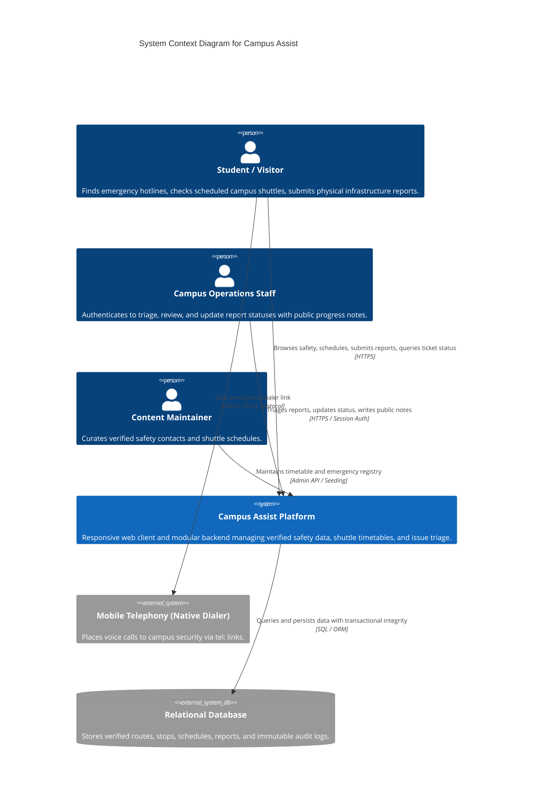
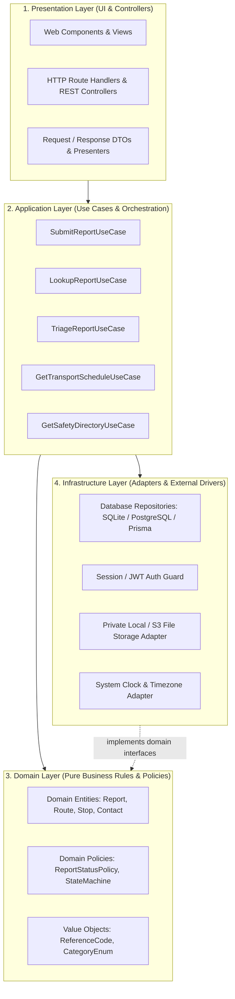
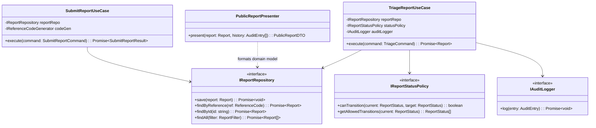
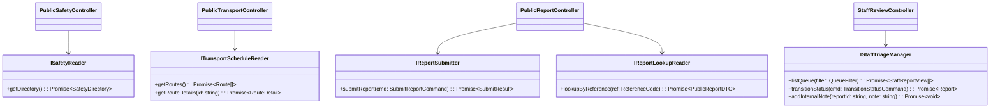
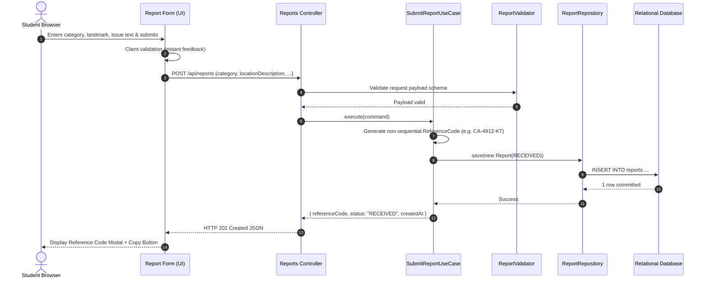
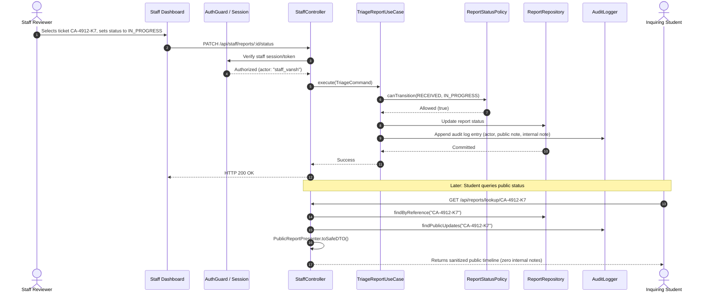

# Campus Assist — Architecture, Technical Design & SOLID Principles Specification

**Document Status:** Phase 0 Baseline  
**Document Version:** 1.0.0  
**Authors & Architects:** Ishika, Tishya, Krisha, Vansh  
**Target Implementation Engine:** Antigravity AI Engineering Pair  
**Companion Documents:**
- PRD: [`01-PRD-product-requirements.md`](file:///c:/Users/ishuv/ProjectWork/docs/01-PRD-product-requirements.md)
- SRD: [`02-SRD-system-requirements.md`](file:///c:/Users/ishuv/ProjectWork/docs/02-SRD-system-requirements.md)
- UX & Interface Specification: [`04-UX-UI-DESIGN-SPEC.md`](file:///c:/Users/ishuv/ProjectWork/docs/04-UX-UI-DESIGN-SPEC.md)
- Phase Plan & Engineering Guide: [`05-PHASE-PLAN-AND-ENGINEERING-GUIDE.md`](file:///c:/Users/ishuv/ProjectWork/docs/05-PHASE-PLAN-AND-ENGINEERING-GUIDE.md)

---

## 1. Architectural Overview & Topology

Campus Assist is designed as a **Modular Monolith** with a responsive, mobile-first web frontend and a single deployable backend organized into three decoupled domain modules: **Safety**, **Transport**, and **Reports**.

### 1.1 Context Diagram (C4 Level 1)



### 1.2 Architectural Boundaries & Why Modular Monolith?
* **Right-Sized Complexity:** For a student team of four (Ishika, Tishya, Krisha, Vansh), microservices, message queues (Kafka/RabbitMQ), and distributed transactions introduce needless failure modes, orchestration overhead, and debugging friction.
* **Co-located Domain Modules:** High cohesion within modules (Safety, Transport, Reports) and loose coupling between them via clear interfaces. Modules can be developed independently by feature owners and tested in isolation.
* **Extensibility:** If an institutional campus bus API or enterprise ticket tracker (e.g., ServiceNow) is integrated in the future, the module boundaries provide clean seams for microservice extraction without rewriting core business logic.

---

## 2. Four-Tier Clean Layered Architecture

To prevent spaghetti code where SQL queries, HTTP handlers, and UI markup are intermingled, the backend and frontend adhere to a strict four-tier Clean Architecture pattern:



### Layer Responsibilities
1. **Presentation Layer:**
   - Handles HTTP routing, request parsing, serialization, and status codes.
   - Converts domain objects into sanitized Data Transfer Objects (DTOs).
   - Zero business rules or SQL queries allowed.
2. **Application / Use Case Layer:**
   - Coordinates specific user workflows (e.g., `SubmitReportUseCase`).
   - Enforces transactional boundaries and calls domain policies.
   - Depends only on Domain contracts (interfaces) and pure data structures.
3. **Domain Layer:**
   - The heart of the application containing pure enterprise logic.
   - Defines entities (`Report`), value objects (`ReferenceCode`), and business policies (`ReportStatusPolicy`).
   - Zero external framework dependencies (no Express, no Prisma, no React, no SQLite imports).
4. **Infrastructure Layer:**
   - Implements abstractions defined by the Domain and Application layers.
   - Contains concrete database repositories, file system storage, cryptographic hashers, and authentication guards.

---

## 3. Deep-Dive: Concrete Application of SOLID Principles

The user has explicitly mandated that the engineering implementation strictly follow **SOLID principles**. Below is the exhaustive research, concrete code design, and architectural enforcement of each principle in Campus Assist.



### 3.1 Single Responsibility Principle (SRP)
> *"A class or module should have one, and only one, reason to change." — Robert C. Martin*

In typical novice web applications, an API controller often checks user credentials, validates input formats, executes SQL queries, evaluates status transition rules, logs audit events, formats output JSON, and sends emails. Such a class has 7 different reasons to change.

In Campus Assist, responsibilities are rigorously segregated:
* **`ReportStatusPolicy`:** Its *sole reason to change* is a change in the institutional business rules governing ticket state transitions (e.g., if the university introduces a new `UNDER_INVESTIGATION` state). It knows nothing about databases or HTTP.
* **`ReportRepository`:** Its *sole reason to change* is a schema alteration or migration of database storage engines (e.g., migrating from SQLite to PostgreSQL).
* **`PublicReportPresenter`:** Its *sole reason to change* is a change in public disclosure or privacy policies (e.g., deciding to hide specific landmark details from the public status tracker).
* **`ReportAuditLogger`:** Its *sole reason to change* is compliance/auditing storage format modifications.
* **`SafetyDirectoryService`:** Its *sole reason to change* is how safety contacts and emergency assembly locations are retrieved or refreshed.
* **`ReportValidator`:** Its *sole reason to change* is modification of input validation constraints (character lengths, enum categories).

#### Code Blueprint (SRP in Action):
```typescript
// Pure Domain Policy: SOLE RESPONSIBILITY = State transition rules
export class ReportStatusPolicy implements IReportStatusPolicy {
  private static readonly ALLOWED_TRANSITIONS: Record<ReportStatus, ReportStatus[]> = {
    [ReportStatus.RECEIVED]: [ReportStatus.IN_REVIEW, ReportStatus.DUPLICATE, ReportStatus.REJECTED],
    [ReportStatus.IN_REVIEW]: [ReportStatus.IN_PROGRESS, ReportStatus.DUPLICATE, ReportStatus.REJECTED],
    [ReportStatus.IN_PROGRESS]: [ReportStatus.RESOLVED, ReportStatus.IN_REVIEW],
    [ReportStatus.RESOLVED]: [ReportStatus.IN_REVIEW],
    [ReportStatus.DUPLICATE]: [ReportStatus.IN_REVIEW],
    [ReportStatus.REJECTED]: [ReportStatus.IN_REVIEW],
  };

  public canTransition(current: ReportStatus, target: ReportStatus): boolean {
    const validTargets = ReportStatusPolicy.ALLOWED_TRANSITIONS[current] || [];
    return validTargets.includes(target);
  }

  public getAllowedTransitions(current: ReportStatus): ReportStatus[] {
    return ReportStatusPolicy.ALLOWED_TRANSITIONS[current] || [];
  }
}

// Pure Presenter: SOLE RESPONSIBILITY = Sanitizing domain entity for student view
export class PublicReportPresenter {
  public static toSafeDTO(report: Report, publicUpdates: AuditEntry[]): PublicReportDTO {
    return {
      referenceCode: report.referenceCode.value,
      category: report.category,
      locationDescription: report.locationDescription,
      status: report.status,
      createdAt: report.createdAt.toISOString(),
      updates: publicUpdates
        .filter(u => Boolean(u.publicMessage))
        .map(u => ({
          status: u.newStatus,
          message: u.publicMessage!,
          timestamp: u.createdAt.toISOString()
        }))
    };
  }
}
```

---

### 3.2 Open/Closed Principle (OCP)
> *"Software entities should be open for extension, but closed for modification." — Bertrand Meyer*

Code should be structured such that new functionality can be added by adding new code, without modifying existing, tested, working classes.

In Campus Assist, OCP is enforced across two major seams:
1. **Extensible Transport Schedule Providers:**
   The transport module defines an abstract schedule provider interface (`ITransportScheduleProvider`). Today, Antigravity implements `StaticJsonScheduleProvider` backed by seeded local files. When the university connects a real GTFS feed in Phase 4 or beyond, a new `GtfsScheduleProvider` class can be registered without editing a single line of `TransportService` or the UI controller.
2. **Incident Category Strategy Registry:**
   Different problem categories may require distinct validation rules or triage routing (e.g., `ACCESSIBILITY` issues may require an immediate priority flag, whereas `CLEANLINESS` issues follow standard queuing). Instead of growing a giant `switch (category)` block, we use a Category Strategy Registry where new category handlers register themselves.

#### Code Blueprint (OCP in Action):
```typescript
// Open for extension via interface implementation
export interface ITransportScheduleProvider {
  getRoutes(): Promise<Route[]>;
  getRouteDetails(routeId: string): Promise<RouteDetail | null>;
  getActiveNotices(now: Date): Promise<ServiceNotice[]>;
}

// Baseline implementation: Seeded / Fixture Provider
export class StaticJsonScheduleProvider implements ITransportScheduleProvider {
  constructor(private readonly seedData: CampusTransportDataset) {}
  public async getRoutes(): Promise<Route[]> { /* returns seeded routes */ }
  public async getRouteDetails(routeId: string): Promise<RouteDetail | null> { /* ... */ }
  public async getActiveNotices(now: Date): Promise<ServiceNotice[]> { /* ... */ }
}

// Future extension: GTFS / API Provider without altering TransportService!
export class GtfsRealtimeScheduleProvider implements ITransportScheduleProvider {
  constructor(private readonly feedUrl: string) {}
  public async getRoutes(): Promise<Route[]> { /* fetches from institutional feed */ }
  public async getRouteDetails(routeId: string): Promise<RouteDetail | null> { /* ... */ }
  public async getActiveNotices(now: Date): Promise<ServiceNotice[]> { /* ... */ }
}
```

---

### 3.3 Liskov Substitution Principle (LSP)
> *"Subtypes must be substitutable for their base types without altering the correctness of the program." — Barbara Liskov*

If a class `B` implements interface `A`, replacing `A` with `B` must not violate client expectations, throw unexpected exceptions, or alter domain invariants.

In Campus Assist, LSP guarantees:
1. **Schedule Provider Invariant:**
   Any `ITransportScheduleProvider` (mock, fixture, or live) must honor the contract: departure times must always be returned in the configured campus time zone (`Asia/Kolkata`), unavailable schedules must return an explicit `UNAVAILABLE` descriptor rather than returning `null` or throwing unhandled errors, and timestamps must be valid ISO-8601 strings. A live provider must *never* return synthetic simulated positions if live tracking is unavailable.
2. **Repository Invariant:**
   An `InMemoryReportRepository` (used in automated unit and regression tests) must exhibit the exact same behavioral invariants as `SqliteReportRepository` or `PrismaReportRepository`:
   - Submitting duplicate reference codes must reject with a `DuplicateKeyException`.
   - Retrieving a non-existent reference code must return `null` (not throw).
   - Atomic state transitions must update the `updatedAt` timestamp.

#### Code Blueprint (LSP in Action):
```typescript
// Contract test verifying LSP compliance across all repository implementations
export function runReportRepositoryLspTestSuite(repoFactory: () => IReportRepository) {
  describe("IReportRepository LSP Compliance", () => {
    let repo: IReportRepository;
    beforeEach(() => { repo = repoFactory(); });

    it("should return null when finding non-existent reference code", async () => {
      const result = await repo.findByReference(ReferenceCode.create("CA-0000-00"));
      expect(result).toBeNull();
    });

    it("should enforce reference code uniqueness invariant", async () => {
      const r1 = createTestReport("CA-1234-AB");
      const r2 = createTestReport("CA-1234-AB");
      await repo.save(r1);
      await expect(repo.save(r2)).rejects.toThrow(DuplicateReferenceCodeError);
    });
  });
}
```

---

### 3.4 Interface Segregation Principle (ISP)
> *"Clients should not be forced to depend on methods they do not use." — Robert C. Martin*

Fat, monolithic interfaces (e.g., an `ICampusManager` interface with 25 methods covering safety, transit, report submission, staff review, user auth, and seed data) couple disparate modules together. A change in staff triage would force a recompile or test run on the public safety viewer.

In Campus Assist, interfaces are segregated into fine-grained, role-tailored contracts:



* **Public Student Clients** depend *only* on `ISafetyReader`, `ITransportScheduleReader`, `IReportSubmitter`, and `IReportLookupReader`. They are physically incapable of calling triage or mutation methods because those methods do not exist on their injected interfaces.
* **Staff Clients** depend on `IStaffTriageManager`.

---

### 3.5 Dependency Inversion Principle (DIP)
> *"High-level modules should not depend on low-level modules. Both should depend on abstractions. Abstractions should not depend on details. Details should depend on abstractions." — Robert C. Martin*

High-level business policies (Use Cases and Domain rules) must remain decoupled from low-level plumbing (Express/Fastify, SQLite/PostgreSQL, disk I/O, or third-party cloud SDKs).

In Campus Assist:
* Use cases (`SubmitReportUseCase`, `TriageReportUseCase`) import only domain entities and TypeScript interfaces (`IReportRepository`, `IAuditLogger`, `IClock`).
* Concrete drivers (`SqliteReportRepository`, `ConsoleAuditLogger`, `SystemClock`) live in the Infrastructure layer and implement those interfaces.
* A central Dependency Injection (DI) container or composition root (`src/container.ts`) wires concrete instances into use cases at application boot.

#### Code Blueprint (DIP in Action):
```typescript
// High-Level Application Use Case: Depends ONLY on Abstractions
export class TriageReportUseCase {
  constructor(
    private readonly reportRepo: IReportRepository,       // Abstraction
    private readonly statusPolicy: IReportStatusPolicy,   // Abstraction
    private readonly auditLogger: IAuditLogger,           // Abstraction
    private readonly clock: IClock                        // Abstraction
  ) {}

  public async execute(command: TriageCommand): Promise<Report> {
    const report = await this.reportRepo.findById(command.reportId);
    if (!report) throw new ReportNotFoundError(command.reportId);

    // Business rule execution via policy abstraction
    const isAllowed = this.statusPolicy.canTransition(report.status, command.targetStatus);
    if (!isAllowed) {
      throw new InvalidStatusTransitionError(report.status, command.targetStatus);
    }

    const previousStatus = report.status;
    report.updateStatus(command.targetStatus, this.clock.now());

    // Atomic persistence and audit recording
    await this.reportRepo.save(report);
    await this.auditLogger.log({
      reportId: report.id,
      previousStatus,
      newStatus: command.targetStatus,
      publicMessage: command.publicMessage,
      internalNote: command.internalNote,
      actorId: command.staffActorId,
      createdAt: this.clock.now()
    });

    return report;
  }
}
```

---

## 4. End-to-End Data Flow Architecture

### 4.1 Flow 1: Submit Report Flow


### 4.2 Flow 2: Staff Triage & Public Update Flow


---

## 5. Security & Privacy Architecture

1. **Untrusted Input Sanitization:**
   * Every string entering via `POST /api/reports` is treated as hostile.
   * Strip HTML tags, escape markdown syntax, and enforce strict length bounds (15–500 chars).
   * Prohibit SQL injection through parameterized queries / ORM mapping.
2. **Opaque Reference Code Generation:**
   * Format: `CA-[4 numeric digits]-[2 uppercase letters]` (e.g. `CA-8319-XF`).
   * Generated via cryptographically secure pseudo-random generators (`crypto.randomInt`).
   * Internal database primary keys (e.g., auto-increment integers) are never exposed.
3. **Role-Based Access Control (RBAC):**
   * `/api/staff/*` routes sit behind an authentication guard.
   * Hiding a UI button is treated as security through obscurity; the server must validate authorization on every administrative mutation.
4. **Defense-in-Depth Attachment Pipeline (If Enabled):**
   * Default configuration: Disabled for MVP baseline to avoid vulnerabilities.
   * If enabled:
     - Allowlist: strictly `image/jpeg`, `image/png`, `image/webp`.
     - File magic byte verification (sniffing buffer header, not trusting file extension).
     - File size capped at 3MB.
     - Filename replaced with a random UUIDv4; original client filenames discarded.
     - Stored outside the web root; served only through authenticated routes or presigned URLs with `Content-Disposition: attachment`.
5. **Rate Limiting & Anti-Scraping:**
   * IP-based rate limiting on report submission (max 5 requests/minute).
   * IP-based rate limiting on reference lookup (max 20 requests/minute) to defeat brute-force reference code enumeration.

---

## 6. Operational Failure Modes & Circuit Breakers

* **Database Degradation / Outage:**
  The emergency safety directory (`/api/safety`) must have a static pre-rendered fallback embedded directly within the client bundle or edge cache. A database crash must never render emergency phone numbers unreachable.
* **Missing Shuttle Schedules:**
  If a timetable is unverified or the transit feed returns empty, the UI displays an explicit, friendly unavailable banner pointing students to the campus physical transport kiosk, rather than showing broken layouts or generating fake placeholder countdowns.
* **Client Network Interruption:**
  If a student loses Wi-Fi while submitting a report, the form state must be preserved in `sessionStorage`. When network restores, the user can retry submission without retyping their landmark description.

---

## 7. Architecture Decision Records (ADRs)

| ADR ID | Decision Title | Status | Summary of Decision & Rationale |
|---|---|---|---|
| **ADR-001** | Modular Monolith Deployment | **Accepted** | Deploy as a single responsive web app and single backend service. Avoids multi-container overhead while maintaining clear internal package boundaries. |
| **ADR-002** | Relational Persistence | **Accepted** | Use a relational database (SQLite for local dev/demo, PostgreSQL for production) to guarantee ACID transactional consistency between status transitions and audit logs. |
| **ADR-003** | Non-Sequential Reference Codes | **Accepted** | Prevent sequential enumeration attacks. Public lookup uses `CA-XXXX-XX` format with public projection DTOs. |
| **ADR-004** | Scheduled Transit Model (No Live GPS) | **Accepted** | Reject fake live vehicle tracking. Truth in capability: timetables are clearly badged as scheduled with explicit campus timezone. |
| **ADR-005** | Static Safety Directory Resiliency | **Accepted** | Emergency telephone numbers must be available offline/cached to guarantee zero-fail emergency access. |
| **ADR-006** | Strict File Upload Guardrails | **Accepted** | Image uploads are optional and default to disabled unless private object storage and magic-byte sanitization are configured. |

---

## 8. Architectural References

1. Martin, Robert C. *Clean Architecture: A Craftsman's Guide to Software Structure and Design*. Prentice Hall, 2017.
2. Martin, Robert C. *Design Principles and Design Patterns (SOLID)*. Object Mentor, 2000.
3. Fowler, Martin. *Patterns of Enterprise Application Architecture*. Addison-Wesley, 2002.
4. OWASP Foundation. *OWASP Top 10 Web Application Security Risks*. 2021.
5. W3C. *Web Content Accessibility Guidelines (WCAG) 2.2*. W3C Recommendation, 2023.
