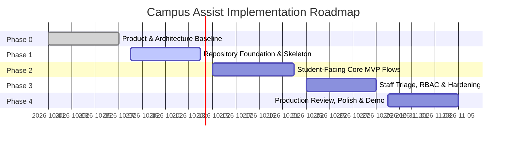

# Campus Assist — Phase Plan, Team Ownership & Antigravity Engineering Guide

**Document Status:** Phase 0 Baseline  
**Document Version:** 1.0.0  
**Team Members & Stakeholders:** 
- **Ishika** — Frontend Shell & Design System Lead
- **Tishya** — Transport Feature Lead
- **Krisha** — Incident Reporting & Staff Triage Lead
- **Vansh** — Backend, Persistence & Security Lead  
**Implementation Engine:** Antigravity AI Engineering Pair  
**Companion Documents:**
- PRD: [`01-PRD-product-requirements.md`](file:///c:/Users/ishuv/ProjectWork/docs/01-PRD-product-requirements.md)
- SRD: [`02-SRD-system-requirements.md`](file:///c:/Users/ishuv/ProjectWork/docs/02-SRD-system-requirements.md)
- Architecture & SOLID Design: [`03-ARCHITECTURE-AND-SOLID-DESIGN.md`](file:///c:/Users/ishuv/ProjectWork/docs/03-ARCHITECTURE-AND-SOLID-DESIGN.md)
- UX & Interface Specification: [`04-UX-UI-DESIGN-SPEC.md`](file:///c:/Users/ishuv/ProjectWork/docs/04-UX-UI-DESIGN-SPEC.md)

---

## 1. Team Working Agreement & Collaboration Cadence

To guarantee smooth delivery across all four student engineers and the Antigravity pair programmer, the team operates under the following shared working principles:

1. **Short, Incremental Phase Gates:** Work proceeds in discrete, testable phases. No phase is marked complete until its written exit criteria are fully validated.
2. **Feature Ownership with Shared Contracts:** While one engineer owns each domain slice, API contracts, entity schemas, and cross-cutting concerns are co-designed and locked before implementation begins.
3. **Continuous Runnable State:** The application must remain in a runnable, compilable state at every commit. Setup instructions must stay updated in the root repository documentation.
4. **Adherence to Architectural Truth & SOLID:** Every pull request and generated module must conform strictly to the SOLID design principles defined in [`03-ARCHITECTURE-AND-SOLID-DESIGN.md`](file:///c:/Users/ishuv/ProjectWork/docs/03-ARCHITECTURE-AND-SOLID-DESIGN.md).

### Collaboration Rhythm
* **Contract Sync (15 min at start of phase):** Agree on endpoint signatures, JSON schemas, status enums, and component props.
* **Mid-Phase Integration Check:** Merge vertical feature slices onto the shared integration branch; test end-to-end user journeys together.
* **Phase Gate Sign-Off:** Review phase deliverables against the SRS acceptance checklist before advancing to the next milestone.

---

## 2. Team Responsibility Matrix (RACI)

| Milestone / Deliverable | Ishika | Tishya | Krisha | Vansh | Antigravity AI |
|---|:---:|:---:|:---:|:---:|:---:|
| **Design System & Responsive Shell** | **A / R** | C | C | C | **S** |
| **Home & Safety Presentation** | **A / R** | C | I | C | **S** |
| **Transport Routes & Schedules** | C | **A / R** | I | C | **S** |
| **Problem Reporting Form & UX** | C | I | **A / R** | C | **S** |
| **Public Status Lookup Interface** | C | I | **A / R** | C | **S** |
| **Staff Triage Dashboard & Controls** | C | I | **A / R** | C | **S** |
| **Backend Architecture & API Gateway**| C | C | C | **A / R** | **S** |
| **Database Schema, Migrations & Seed**| I | C | C | **A / R** | **S** |
| **Security, RBAC & State Policy Guard**| I | I | C | **A / R** | **S** |
| **SOLID Principles Audit & Refactoring**| C | C | C | C | **A / R** |

*Legend: **A** = Accountable, **R** = Responsible, **C** = Consulted, **I** = Informed, **S** = Supporting Pair Programmer.*

---

## 3. Phased Implementation Roadmap & Hard Exit Gates



### Phase 0: Baseline Specifications & Architecture (Current Gate)
* **Goal:** Establish unambiguous product boundaries, formal system requirements, clean 4-tier architecture, UX design tokens, and SOLID specifications.
* **Deliverables:** The 5 core Phase 0 Markdown specifications in `/docs`.
* **Exit Gate Checklist:**
  - [x] All 5 documents authored, reviewed, and linked.
  - [x] Anti-goals (no fake live GPS, no 911 dispatch claims) explicitly ratified.
  - [x] State transition model and RBAC security rules formally defined.
  - [x] SOLID principles codified with concrete class/interface patterns.

---

### Phase 1: Repository Foundation, Design Tokens & Vertical Skeleton
* **Team Assignments:**
  - **Vansh:** Initialize project repository (Node.js/TypeScript backend with SQLite/Prisma or clean Express/Fastify; configure typed validation via Zod). Setup environment configuration (`.env.example`) and database migration pipeline.
  - **Ishika:** Establish frontend project (Vite/React or Next.js with Vanilla CSS design tokens). Build global navigation shell, responsive layout, accessible typography, and persistent emergency action banner.
  - **Tishya:** Prepare JSON fixture files for sample shuttle routes, ordered stops, departure timetables, and active service disruption notices.
  - **Krisha:** Scaffold wireframe screens for the Problem Reporting form, Reference Code Confirmation modal, Public Status Lookup view, and Staff Review dashboard.
* **Exit Gate Checklist:**
  - [ ] Teammates can clone the repo and run both client and server locally using documented `npm install` and `npm run dev` commands.
  - [ ] All four primary routes (`/`, `/safety`, `/transport`, `/report`) are navigable without errors.
  - [ ] Emergency callout is prominent on mobile and desktop viewports.
  - [ ] Visible `DEMO DATA` banner appears consistently across all views.

---

### Phase 2: Student-Facing Core MVP Flows
* **Team Assignments:**
  - **Ishika:** Complete Safety directory page (`/safety`) with verified security hotlines, one-tap `tel:` dialer buttons, clipboard copy triggers, and safe physical assembly zones.
  - **Tishya:** Connect Transport page (`/transport`) to the route and schedule read APIs. Implement route tab switcher, stop sequence timeline, departure times (in `Asia/Kolkata` IST timezone), and service notice alerts. Implement empty and unavailable schedule states.
  - **Krisha:** Implement Problem Reporting form (`/report`) with emergency warning callout, category selector, landmark text input, description character counter, and privacy acknowledgment. Build the reference code confirmation screen (`CA-XXXX-XX`) with 1-click clipboard copy.
  - **Vansh:** Implement public REST APIs: `GET /api/safety`, `GET /api/routes`, `GET /api/routes/:id`, `POST /api/reports`, and `GET /api/reports/lookup/:reference`. Enforce strict server-side validation, non-sequential reference code generation, and public projection filtering (stripping internal notes and DB IDs).
* **Exit Gate Checklist:**
  - [ ] Student can open the app, tap the emergency number, and initiate a phone call in one tap.
  - [ ] Student can inspect shuttle departure timetables with explicit scheduled indicators (zero fake GPS).
  - [ ] Student can submit a facilities report and receive a unique `CA-XXXX-XX` reference code.
  - [ ] Student can query `GET /api/reports/lookup/:reference` and see only safe public progress data.
  - [ ] All form validations provide clear inline error messages and keyboard focus management.

---

### Phase 3: Staff Triage, Security Hardening & Role Authorization
* **Team Assignments:**
  - **Vansh:** Implement authentication guard for `/api/staff/*` endpoints (session/token). Enforce `ReportStatusPolicy` state machine on `PATCH /api/staff/reports/:id/status`. Implement transactional persistence uniting status change, public message, internal note, and immutable `ReportAuditLog`.
  - **Krisha:** Build authenticated Staff Review Dashboard (`/staff`). Implement queue table with category and status filter tabs (`RECEIVED`, `IN_REVIEW`, `IN_PROGRESS`, `RESOLVED`, `DUPLICATE`, `REJECTED`). Build status update modal with distinct public vs. private message inputs.
  - **Ishika:** Conduct comprehensive accessibility audit across all views. Verify WCAG 2.2 AA compliance: keyboard tabbing, focus rings (`:focus-visible`), screen reader `aria-live` announcements for ticket updates, and minimum 48x48px tap targets.
  - **Tishya:** Implement service notice lifecycle management, ensuring expired alerts automatically de-activate based on `endsAt` timestamps.
* **Exit Gate Checklist:**
  - [ ] Unauthenticated requests to `/api/staff/*` are blocked with HTTP 401/403.
  - [ ] Staff can transition tickets through allowed states and publish timestamped public updates.
  - [ ] Illegal state transitions (e.g., `RECEIVED` directly to `RESOLVED`) are rejected with HTTP 422.
  - [ ] Public lookup immediately reflects newly published public updates while keeping internal staff notes private.
  - [ ] Full keyboard navigation and screen reader compatibility verified.

---

### Phase 4: Production Readiness, Demo Script & Final Handover
* **Team Assignments:**
  - **All Four:** Execute end-to-end verification against the SRS validation checklist.
  - **Vansh & Ishika:** Optimize bundle size, ensure offline/cached fallback for emergency contacts, and test rate limiting.
  - **Krisha & Tishya:** Prepare end-to-end evaluation demo script showcasing all three user journeys (Urgent Safety, Shuttle Timetables, and Issue Reporting/Triage).
  - **Antigravity AI:** Perform comprehensive code audit confirming 100% adherence to SOLID principles, with zero dead code or exposed secrets.
* **Exit Gate Checklist:**
  - [ ] Class evaluation demonstration runs end-to-end without bugs or crashes.
  - [ ] All demo data is visibly watermarked.
  - [ ] Zero unhandled promise rejections or console errors.
  - [ ] Handover documentation and institutional decision registry signed off.

---

## 4. Antigravity Implementation Directives (Rules of Engagement)

When writing code, refactoring, or generating features for Campus Assist, **Antigravity MUST adhere to the following strict engineering mandates**:

### 4.1 Recommended Technology Stack
* **Frontend:** React (with Vite or Next.js) using **Vanilla CSS** with the design tokens defined in [`04-UX-UI-DESIGN-SPEC.md`](file:///c:/Users/ishuv/ProjectWork/docs/04-UX-UI-DESIGN-SPEC.md). Avoid heavy Tailwind utility cascades unless specifically requested.
* **Backend:** Node.js with TypeScript using **Express** or **Fastify**, structured in 4 clean layers (Presentation, Application, Domain, Infrastructure).
* **Persistence:** **SQLite** (via Prisma ORM, Kysely, or Better-SQLite3) for local demo simplicity, zero-config setup, and full relational ACID compliance.
* **Validation:** **Zod** or equivalent schema validation library for runtime schema parsing at the HTTP boundary.

### 4.2 Code Organization & Directory Structure
```text
c:\Users\ishuv\ProjectWork\
├── docs\                                  # Phase 0 Specifications
│   ├── 01-PRD-product-requirements.md
│   ├── 02-SRD-system-requirements.md
│   ├── 03-ARCHITECTURE-AND-SOLID-DESIGN.md
│   ├── 04-UX-UI-DESIGN-SPEC.md
│   └── 05-PHASE-PLAN-AND-ENGINEERING-GUIDE.md
├── src\
│   ├── presentation\                      # HTTP routes, controllers, serializers
│   │   ├── controllers\
│   │   ├── dtos\
│   │   └── web\                           # Frontend UI components & pages
│   ├── application\                       # Use cases & workflows
│   │   ├── use-cases\
│   │   └── interfaces\                    # Inbound & outbound contracts
│   ├── domain\                            # Pure business rules & entities
│   │   ├── entities\
│   │   ├── policies\                      # ReportStatusPolicy
│   │   └── value-objects\                 # ReferenceCode, Category
│   └── infrastructure\                    # Concrete adapters & external drivers
│       ├── persistence\                   # SQLite repositories
│       ├── auth\                          # Session & RBAC guard
│       └── config\                        # Environment & seed loader
├── tests\                                 # Unit, integration, and LSP contract tests
└── README.md                              # Master project overview & setup guide
```

### 4.3 Strict Anti-Patterns & Prohibitions (Never Do This)
1. **NO Fake Emergency Dispatching:** Never generate simulated call dispatch screens, fake 911 chat prompts, or countdowns claiming security officers are en route.
2. **NO Synthetic Live GPS Bus Maps:** Never render simulated moving bus markers, fake GPS coordinates, or artificial arrival countdowns. Always label schedules as *Scheduled Timetables*.
3. **NO Monolithic Fat Controllers:** Never place database queries, auth checks, business validation, and HTML/JSON formatting in a single route handler. Use Use Cases and Repositories.
4. **NO Raw Database Primary Key Leaks:** Never return auto-increment IDs or raw UUIDs as public ticket references. Always use generated `CA-XXXX-XX` reference codes.
5. **NO Public Data Leaks:** Never return internal staff notes, reporter IP addresses, or raw file upload paths in public lookup endpoints.
6. **NO Hardcoded Credentials or Secrets:** Never commit passwords, tokens, or private keys to source control. Use environment variables.

---

## 5. SOLID Principles Code-Review Checklist

Every code file created or edited by Antigravity must satisfy this checklist:

- [ ] **Single Responsibility (SRP):** Does this class/module have only one reason to change? Are persistence, business validation, and presentation strictly segregated?
- [ ] **Open/Closed (OCP):** Can new incident categories or transport data providers be introduced without modifying existing, tested use-case code?
- [ ] **Liskov Substitution (LSP):** Do all implementations of `ITransportScheduleProvider` and `IReportRepository` satisfy identical invariants without throwing unexpected exceptions?
- [ ] **Interface Segregation (ISP):** Are client interfaces narrow and role-tailored (`ISafetyReader`, `ITransportScheduleReader`, `IReportSubmitter`, `IStaffTriageManager`) rather than one giant interface?
- [ ] **Dependency Inversion (DIP):** Do high-level use cases depend strictly on abstract domain interfaces, with all concrete database/HTTP drivers injected at the boundary?

---

## 6. Open Institutional Decisions & Configuration Parameters

The following operational decisions require formal confirmation from university leadership before moving from demonstration to campus-wide production rollout:

| Decision Item | Phase 0 Baseline (Demo) | Production Requirement |
|---|---|---|
| **Campus Time Zone** | `Asia/Kolkata` (IST, UTC+05:30) | Confirm canonical university timezone. |
| **Emergency Number** | `+91-11-2659-1000` (Demo Security Desk) | Obtain signed confirmation from Campus Security Director. |
| **Transport Feed Source** | Static JSON Timetable Fixtures | Integrate university GTFS feed or transport vendor API. |
| **Staff Triage Ownership** | Local demo credentials (`staff_vansh`) | Connect Campus Single Sign-On (SSO / SAML / OAuth2). |
| **Image Upload Policy** | Default disabled / sandboxed | Provision institutional S3-compatible private storage bucket. |
| **Data Retention Policy** | In-memory / local SQLite | Establish university GDPR/data protection retention schedule. |
